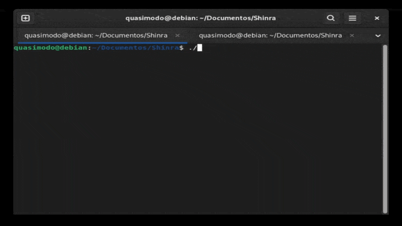

# Hidalgo

A fast file indexer for Linux, inspired by the program [Everything](https://www.voidtools.com/).



## how to compile

1. Install `gcc` and `make` for your distro. e.g.:
   * Debian: 
     ```bash
     sudo apt install build-essential
     ```
2. Open your terminal in the project directory and run:
   ```bash
   make
   ```

## how to run
compile or download from the releases, and run it.
it is a CLI (command line interface) so it must be run on terminal
```use:
 ./hidalgo [OPTIONS] <path> <term>
  -n N max results (default: 0, 0 = all)
```
e.g. of using:
```./hidalgo ~/ *.o ```

## list of things to do
- [x] in-memory index with hashmap
- [x] recursive directory scan
- [x] fuzzy search
- [x] basic cli only for testing
- [x] parallel scan with threads
- [x] persistent cache
- [x] ignore system/temp files on linux
- [ ] real time monitoring
- [ ] add a gui 
